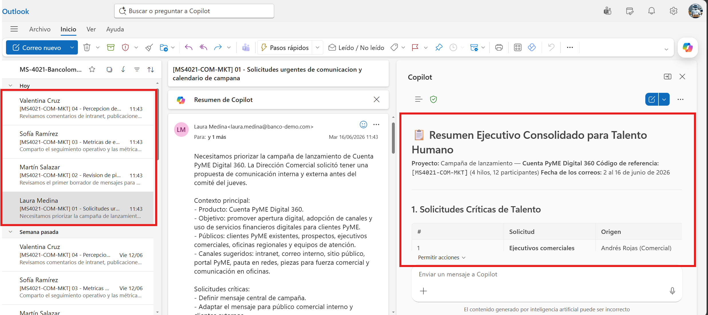
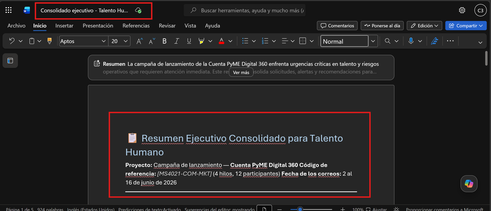
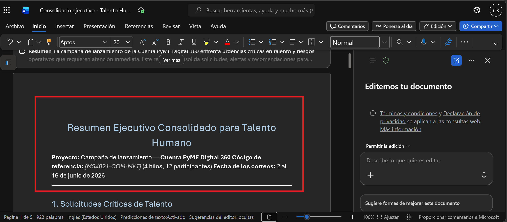

# Demostración 1. Preparar el contexto de talento humano desde Outlook

## Objetivo de la práctica:
Al finalizar la práctica, serás capaz de:
- Priorizar correos relacionados con procesos de selección, retroalimentación de líderes y solicitudes críticas de Talento Humano.
- Usar Copilot en Outlook para resumir cadenas de correo con foco ejecutivo, riesgos, áreas involucradas y acciones pendientes.
- Construir un bloque de contexto que alimente el análisis posterior en Excel y Microsoft 365 Copilot Chat.

## Duración aproximada:
- 15 minutos.

## Instrucciones 
<!-- Proporciona pasos detallados sobre cómo configurar y administrar sistemas, implementar soluciones de software, realizar pruebas de seguridad, o cualquier otro escenario práctico relevante para el campo de la tecnología de la información -->
### Tarea 1. Preparar el buzón y localizar los correos de Talento Humano.

**Paso 1.** Abrir Outlook con la cuenta corporativa asignada para la demostración.

**Paso 2.** Buscar primero con el distintivo `[MS4021-HR-TALENTO]`. Este distintivo se ha usado para marcar correos relacionados con talento humano, selección, clima y retención en el contexto de esta demostración.

**Paso 3.** Identificar cuatro correos consolidados que representen las siguientes perspectivas:
- Solicitud urgente de contratación para una vacante estratégica.
- Retroalimentación de líderes sobre desempeño, competencias y clima.
- Movilidad interna y comparación de candidatos.
- Bienestar, clima y riesgos de retención.

---

### Tarea 2. Usar Copilot en Outlook para resumir y priorizar las cadenas.

**Paso 1.** Abrir el primer correo relacionado con la solicitud urgente de contratación.

**Paso 2.** Seleccionar Copilot en Outlook y solicitar un resumen ejecutivo del hilo.

Prompt sugerido:

```text
Resume esta cadena de correos desde una perspectiva ejecutiva para el área de Talento Humano de un banco. Identifica:
1. Tema principal.
2. Solicitud o necesidad de talento humano.
3. Riesgos asociados con cobertura, desempeño, clima o retención.
4. Áreas o líderes involucrados.
5. Información que debe validarse antes de decidir.
6. Decisiones o acciones pendientes.
7. Nivel de urgencia: alto, medio o bajo.
```

**Paso 3.** Revisar la respuesta de Copilot y validar que no incluya información no mencionada en el correo.

**Paso 4.** Repetir el análisis con los otros tres correos consolidados.

**Paso 5.** Solicitar a Copilot que consolide los cuatro resúmenes en un solo bloque ejecutivo.

Prompt sugerido:

```text
Consolida los resúmenes de los cuatro correos en un solo bloque ejecutivo para Talento Humano. Prioriza la información según urgencia e impacto en selección, desarrollo, movilidad interna, bienestar y retención.

Organiza el resultado con esta estructura:
1. Solicitudes críticas de talento.
2. Alertas sobre desempeño, competencias y clima.
3. Oportunidades de movilidad interna.
4. Riesgos de rotación o bienestar.
5. Acciones recomendadas para continuar el análisis en Excel y Copilot Chat.
```



**Paso 6.** Al finalizar la respuesta de Copilot, seleccionar los tres puntos y usar la opción disponible para exportar el contenido en Word.

**Paso 7.** Cambiar el título del documento a `Consolidado ejecutivo - Talento Humano y vacante estratégica`.



### Resultado esperado
Al finalizar, el instructor debe contar con un consolidado ejecutivo generado a partir de cuatro correos consolidados, donde se evidencien solicitudes críticas de contratación, señales de clima, oportunidades de movilidad interna y riesgos de retención.

