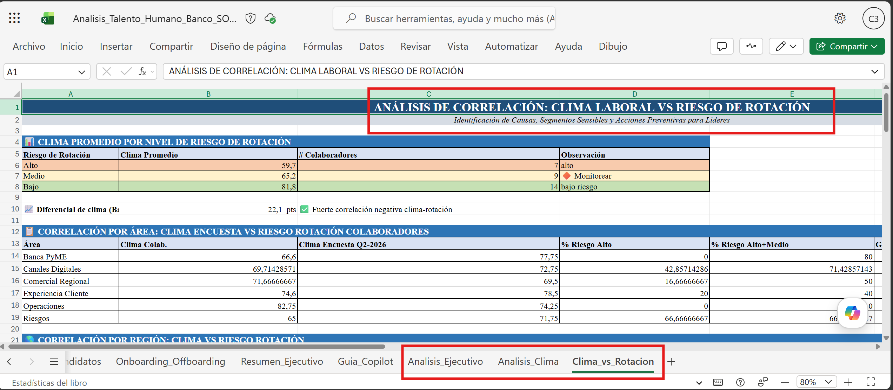
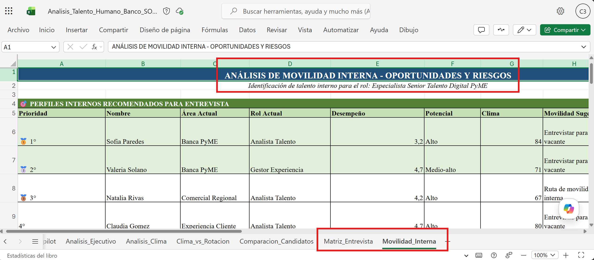
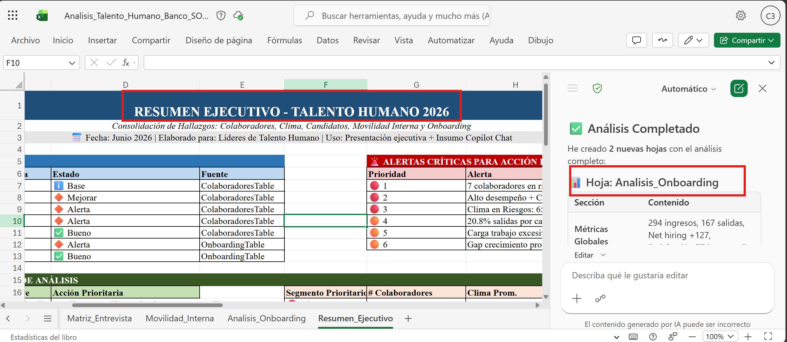
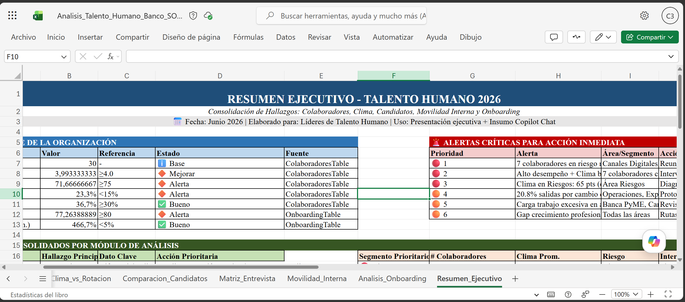

# Demostración 2. Analizar información de colaboradores y candidatos con Copilot en Excel

## Objetivo de la práctica:
Al finalizar la práctica, serás capaz de:
- Usar Copilot en Excel para analizar desempeño, clima laboral, onboarding, offboarding y riesgo de rotación.
- Comparar competencias entre candidatos y perfiles internos para apoyar procesos de selección y movilidad.
- Generar explicaciones en lenguaje natural sobre hallazgos relevantes para Talento Humano.

## Duración aproximada:
- 20 minutos.

## Instrucciones 
<!-- Proporciona pasos detallados sobre cómo configurar y administrar sistemas, implementar soluciones de software, realizar pruebas de seguridad, o cualquier otro escenario práctico relevante para el campo de la tecnología de la información -->
### Tarea 1. Abrir el archivo de talento y revisar la estructura de datos.

**Paso 1.** Abrir Excel en el navegador o en la aplicación de escritorio.

**Paso 2.** Abrir el archivo `Analisis_Talento_Humano_Banco.xlsx` desde OneDrive o SharePoint.

**Paso 3.** Revisar las hojas `Colaboradores`, `Encuesta_Clima`, `Candidatos`, `Onboarding_Offboarding`, `Resumen_Ejecutivo` y `Guia_Copilot`.

**Paso 4.** Activar Copilot en Excel desde la cinta de opciones.

>[!NOTE]
> Explicar que los datos son ficticios y sirven para simular análisis de talento, selección, desarrollo y retención. No se debe usar información real de colaboradores durante la práctica.

---

### Tarea 2. Analizar desempeño, clima y riesgo de rotación.

**Paso 1.** Solicitar a Copilot en Excel una lectura general de talento.

```text
Analiza la tabla `Colaboradores` e identifica patrones relevantes por área, región, desempeño, potencial, clima laboral y riesgo de rotación. Presenta el resultado en una tabla ejecutiva en una hoja nueva para Talento Humano.
```

**Paso 2.** Pedir a Copilot que identifique perfiles críticos.

```text
Identifica colaboradores con alto desempeño o alto potencial que tengan riesgo de rotación medio o alto. Explica qué acciones de retención o desarrollo deberían considerarse para cada grupo.
```

**Paso 3.** Solicitar un análisis de clima laboral.

```text
Usando la hoja `Encuesta_Clima`, resume las principales señales de clima laboral por área y región. Identifica diferencias entre compromiso, carga de trabajo, percepción de liderazgo y claridad de crecimiento.
```

**Paso 4.** Relacionar clima con riesgo de rotación.

Prompt sugerido:

```text
Relaciona los hallazgos de clima laboral con el riesgo de rotación de la hoja `Colaboradores`. Identifica posibles causas, segmentos más sensibles y acciones preventivas para líderes.
```



---

### Tarea 3. Comparar candidatos y perfiles internos.

**Paso 1.** Abrir la hoja `Candidatos`.

**Paso 2.** Solicitar a Copilot que compare candidatos contra el rol estratégico.

```text
Compara los candidatos de la hoja `Candidatos` contra el rol de Especialista Senior de Talento Digital PyME. Considera experiencia en talento humano, analítica de personas, comunicación con líderes, gestión del cambio, conocimiento de banca PyME y potencial de desarrollo.
```

**Paso 3.** Pedir a Copilot que genere una matriz de fortalezas y áreas por validar.

```text
Crea una matriz con las columnas: Candidato, fortalezas principales, áreas por validar, preguntas sugeridas de entrevista, nivel de alineación y recomendación preliminar. Aclara que la recomendación debe ser revisada por Talento Humano y no representa una decisión automática.
```

**Paso 4.** Solicitar una lectura de movilidad interna.

```text
Identifica oportunidades de movilidad interna a partir de los datos de colaboradores y candidatos. Señala qué perfiles internos podrían considerarse para entrevista, qué brechas deberían desarrollarse y qué riesgos existirían si no se consideran candidatos internos.
```



---

### Tarea 4. Analizar onboarding, offboarding y experiencia del colaborador.

**Paso 1.** Abrir la hoja `Onboarding_Offboarding`.

**Paso 2.** Solicitar a Copilot un resumen de tendencias.

```text
Analiza la hoja `Onboarding_Offboarding` e identifica tendencias de satisfacción de onboarding, motivos de salida, permanencia temprana y señales de mejora para experiencia del colaborador.
```

**Paso 3.** Pedir a Copilot que proponga acciones para mejorar experiencia y retención.

```text
Propón acciones de mejora para onboarding, desarrollo y retención. Clasifica las acciones por impacto, dificultad, área responsable y plazo sugerido.
```

**Paso 4.** Solicitar a Copilot que consolide los hallazgos en un bloque ejecutivo.

```text
Consolida los hallazgos de colaboradores, clima, candidatos, movilidad interna y onboarding en un bloque ejecutivo. El resultado debe servir como insumo para Copilot Chat y para la presentación de líderes de Talento Humano.
```



### Resultado esperado
Al finalizar, el instructor debe contar con hallazgos estructurados sobre desempeño, clima, riesgo de rotación, candidatos, movilidad interna y experiencia del colaborador.

