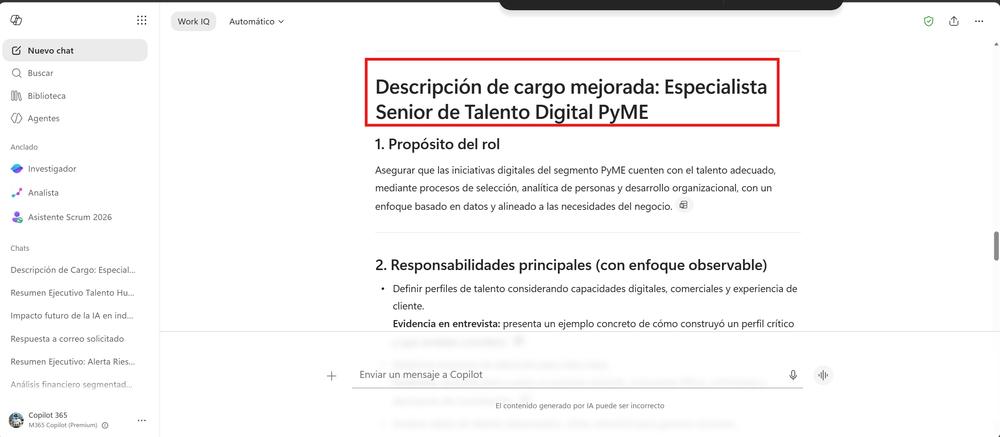
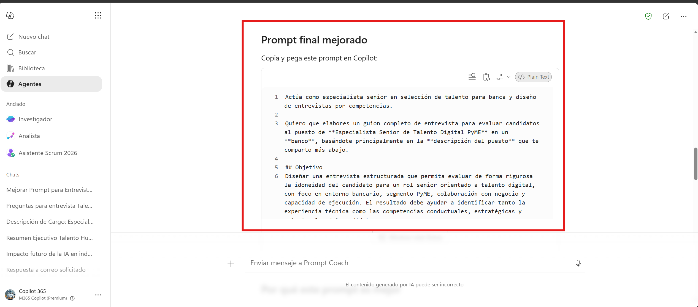
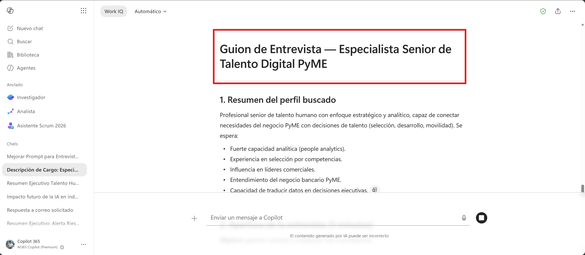
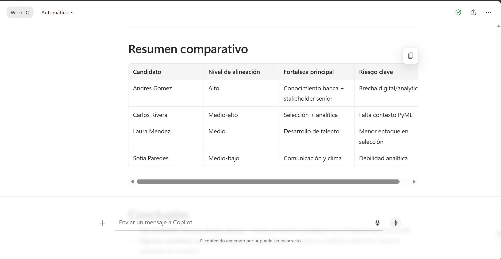
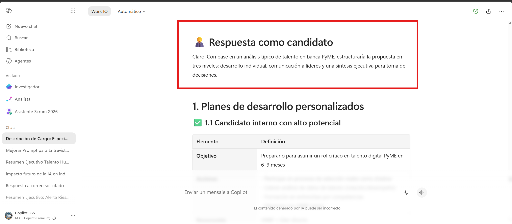

# Demostración 3. Preparar entrevistas y estrategias de desarrollo con Microsoft 365 Copilot Chat y Prompt Coach

## Objetivo de la práctica:
Al finalizar la práctica, serás capaz de:
- Usar Microsoft 365 Copilot Chat para generar y mejorar una descripción de cargo basada en responsabilidades del rol.
- Preparar entrevistas mediante juego de roles y preguntas orientadas por competencias.
- Diseñar planes de desarrollo y comunicación asertiva para líderes usando Prompt Coach.

## Duración aproximada:
- 20 minutos.

## Instrucciones 
<!-- Proporciona pasos detallados sobre cómo configurar y administrar sistemas, implementar soluciones de software, realizar pruebas de seguridad, o cualquier otro escenario práctico relevante para el campo de la tecnología de la información -->
### Tarea 1. Generar una descripción de cargo con Copilot Chat.

**Paso 1.** Abrir Microsoft 365 Copilot Chat desde `https://m365.cloud.microsoft.com/`.

**Paso 2.** Adjuntar o referenciar el archivo `Responsabilidades_Rol_Especialista_Talento_Digital_PyME.docx`.

**Paso 3.** Solicitar a Copilot la creación de una descripción de cargo.

Prompt sugerido:

```text
Actúa como HR Manager de un banco. Con base en el documento de responsabilidades adjunto, crea una descripción de cargo para el cargo Especialista Senior de Talento Digital PyME.

La descripción debe incluir:
1. Propósito del rol.
2. Responsabilidades principales.
3. Competencias requeridas.
4. Experiencia deseada.
5. Indicadores de éxito del rol.
6. Criterios objetivos para evaluación de candidatos.

Usa lenguaje claro, profesional e inclusivo. Evita requisitos que no estén relacionados con el rol.
```

**Paso 5.** Pedir a Copilot que refine la descripción para hacerla más clara y evaluable.

```text
Revisa la descripción de cargo anterior y mejórala para que los criterios sean observables en entrevista. Separa requisitos indispensables, deseables y aspectos que pueden desarrollarse con plan de crecimiento.
```



---

### Tarea 2. Usar Prompt Coach para mejorar prompts de selección y entrevista.

**Paso 1.** Abrir Prompt Coach desde la experiencia disponible en Microsoft 365 Copilot.

**Paso 2.** Ingresar un prompt inicial de entrevista.

Prompt inicial:

```text
Ayudame a Mejorar el siguiente prompt con más contexto, objetivo, formato y criterios de evaluación: Dame una guía de entrevista con preguntas para entrevistar candidatos para el rol de Especialista Senior de Talento Digital PyME.
```

**Paso 3.** Solicitar a Prompt Coach que mejore el prompt con más contexto, objetivo, formato y criterios de evaluación.



**Paso 4.** Usar la versión refinada del prompt entregada por Prompt Coach en Copilot Chat.



---

### Tarea 3. Comparar candidatos y preparar juego de roles.

**Paso 1.** En Copilot Chat, adjuntar los resumes ficticios de candidatos:
- `Resume_Laura_Mendez.docx`
- `Resume_Carlos_Rivera.docx`
- `Resume_Sofia_Paredes.docx`
- `Resume_Andres_Gomez.docx`

**Paso 2.** Solicitar a Copilot una comparación objetiva.

```text
Compara los resumes adjuntos contra la descripción de cargo del rol Especialista Senior de Talento Digital PyME. Ordena los candidatos por nivel de alineación, pero aclara que la decisión final debe ser revisada por el comité de selección.

Incluye fortalezas, áreas por validar, riesgos de ajuste al rol y preguntas recomendadas para entrevista.
```




**Paso 3.** Iniciar un juego de roles para practicar entrevista.

```text
Actúa como candidato al rol Especialista Senior de Talento Digital PyME. Yo actuaré como entrevistador. Responde mis preguntas de forma realista y después de cada intercambio dame retroalimentación sobre si mi pregunta permitió evaluar la competencia esperada.
```
---

### Tarea 4. Diseñar planes de desarrollo y comunicación asertiva.

**Paso 1.** Solicitar a Copilot planes de crecimiento para candidatos o colaboradores.

```text
Con base en el análisis de candidatos y colaboradores, diseña tres planes de desarrollo personalizados: uno para un candidato interno con potencial, uno para un colaborador con alto desempeño y riesgo de rotación, y uno para un líder que necesita mejorar comunicación asertiva. Incluye objetivo, acciones, responsable, plazo y métrica de seguimiento.
```

**Paso 2.** Pedir mensajes de comunicación asertiva para líderes.

```text
Redacta tres mensajes breves para líderes de Talento Humano: uno para comunicar avance del proceso de selección, otro para invitar a entrevistas internas y otro para explicar acciones de desarrollo y retención. Usa tono empático, claro y profesional.
```

**Paso 3.** Solicitar una versión ejecutiva de la propuesta.

```text
Convierte todo lo anterior en una propuesta ejecutiva que incluya un diagnóstico de talento, necesidades de selección, comparación de candidatos, riesgos de rotación, oportunidades de movilidad, planes de desarrollo y próximos pasos.
```

>[!NOTE]
> Resaltar que Copilot apoya la preparación del proceso, pero la decisión final de selección y desarrollo debe realizarse con revisión humana, criterios objetivos y lineamientos internos.

### Resultado esperado
Al finalizar, el instructor debe contar con una descripción de cargo mejorada, una guía de entrevista por competencias, una comparación preliminar de candidatos y una propuesta de desarrollo y comunicación para líderes.

