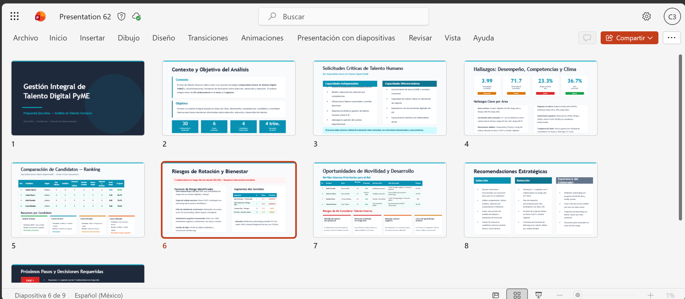
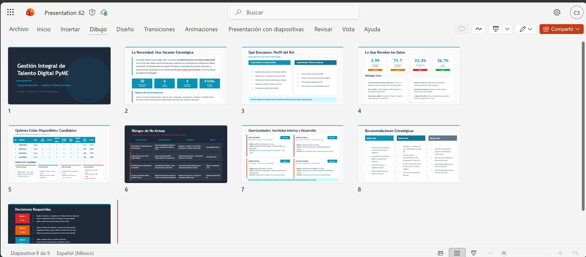
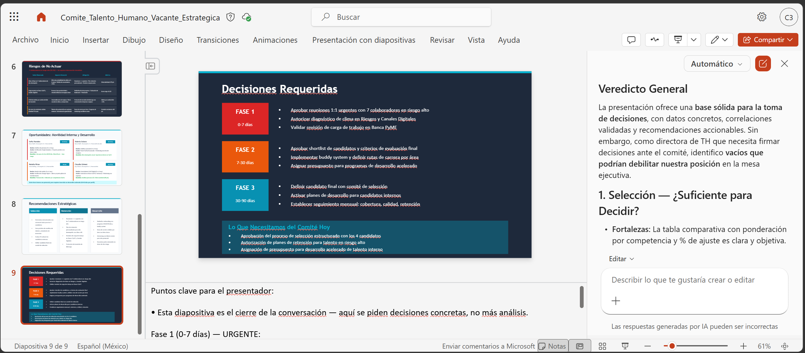

# Demostración 4. Crear una presentación ejecutiva de Talento Humano con Copilot en PowerPoint

## Objetivo de la práctica:
Al finalizar la práctica, serás capaz de:
- Crear una presentación ejecutiva en PowerPoint a partir de los hallazgos generados en Outlook, Excel y Copilot Chat.
- Refinar diapositivas sobre análisis de talento, competencias, perfiles, riesgos de rotación y movilidad interna.
- Preparar una narrativa de decisión para líderes de Talento Humano y áreas directivas.

## Duración aproximada:
- 20 minutos.

## Instrucciones 
<!-- Proporciona pasos detallados sobre cómo configurar y administrar sistemas, implementar soluciones de software, realizar pruebas de seguridad, o cualquier otro escenario práctico relevante para el campo de la tecnología de la información -->
### Tarea 1. Preparar el insumo ejecutivo para PowerPoint.

**Paso 1.** Confirmar que los resultados de Outlook, Excel y Microsoft 365 Copilot Chat estén consolidados.

**Paso 2.** Usar la respuesta generada en Copilot Chat. Si es necesario, realizar ajustes para asegurar que el documento tenga un enfoque ejecutivo, con hallazgos claros, análisis de talento, riesgos y recomendaciones.


**Paso 3.** Verificar que el documento incluya diagnóstico de talento, necesidades de selección, comparación de candidatos, riesgos de rotación, oportunidades de movilidad, planes de desarrollo y próximos pasos.

---

### Tarea 2. Crear la presentación desde Copilot en PowerPoint.

**Paso 1.** Abrir PowerPoint en el navegador o en la aplicación de escritorio.

**Paso 2.** Crear una presentación en blanco.

**Paso 3.** Abrir el panel de Copilot.

**Paso 4.** Seleccionar la opción para crear una presentación desde un archivo o usar el siguiente prompt:

```text
Crea una presentación ejecutiva de 9 diapositivas a partir del documento adjunto. La audiencia son líderes de Talento Humano y áreas directivas de un banco.

La presentación debe incluir:
1. Portada ejecutiva.
2. Contexto y objetivo del análisis.
3. Solicitudes críticas de talento humano.
4. Hallazgos de desempeño, competencias y clima.
5. Comparación de candidatos y perfiles internos.
6. Riesgos de rotación y bienestar.
7. Oportunidades de movilidad y desarrollo.
8. Recomendaciones para fortalecer selección, retención y experiencia del colaborador.
9. Próximos pasos y decisiones requeridas.

Usa lenguaje ejecutivo, mensajes breves y enfoque visual.
```

**Paso 5.** Esperar a que Copilot genere el primer borrador de diapositivas.

**Paso 6.** Revisar la estructura propuesta y validar que incluya una narrativa orientada a decisión.



---

### Tarea 3. Refinar diapositivas clave.

**Paso 1.** Solicitar a Copilot que mejore la narrativa para dirección.

```text
Reorganiza la presentación para que cuente una historia clara: necesidad de talento, evidencia del análisis, riesgos de no actuar, recomendaciones y decisiones requeridas. Mantén máximo una idea principal por diapositiva.
```

**Paso 2.** Solicitar una diapositiva visual de riesgos de rotación.

```text
Convierte la sección de riesgos de rotación y bienestar en una diapositiva visual. Incluye señales observadas, impacto potencial, mitigación recomendada y métrica de seguimiento.
```

**Paso 3.** Solicitar una diapositiva de movilidad y desarrollo.

```text
Agrega una diapositiva sobre oportunidades de movilidad interna y planes de desarrollo. Incluye perfiles a considerar, brechas principales, acciones de crecimiento y beneficios esperados.
```

**Paso 4.** Solicitar notas del presentador.

```text
Genera notas del presentador para cada diapositiva. Usa tono ejecutivo, enfocado en decisiones de Talento Humano, selección, desarrollo y retención.
```



---

### Tarea 4. Validar la presentación final.

**Paso 1.** Confirmar que la presentación responda las preguntas clave de líderes de Talento Humano:
- ¿Qué vacante o necesidad estratégica se debe atender?
- ¿Qué hallazgos de desempeño, clima y competencias soportan la recomendación?
- ¿Qué candidatos o perfiles requieren entrevista o desarrollo?
- ¿Qué riesgos de rotación o bienestar se identificaron?
- ¿Qué decisiones deben tomar los líderes?

**Paso 2.** Solicitar a Copilot una revisión crítica de la presentación.

```text
Actúa como directora de Talento Humano. Revisa esta presentación y dime si contiene información suficiente para decidir próximos pasos sobre selección, movilidad interna, desarrollo y retención. Identifica vacíos de información y recomendaciones de mejora.
```

**Paso 3.** Guardar la presentación con el nombre `Comite_Talento_Humano_Vacante_Estrategica`.

### Resultado esperado
Al finalizar, el instructor debe tener una presentación ejecutiva con hallazgos de talento, análisis de candidatos y colaboradores, riesgos de rotación, oportunidades de movilidad interna y recomendaciones para líderes de Talento Humano.

